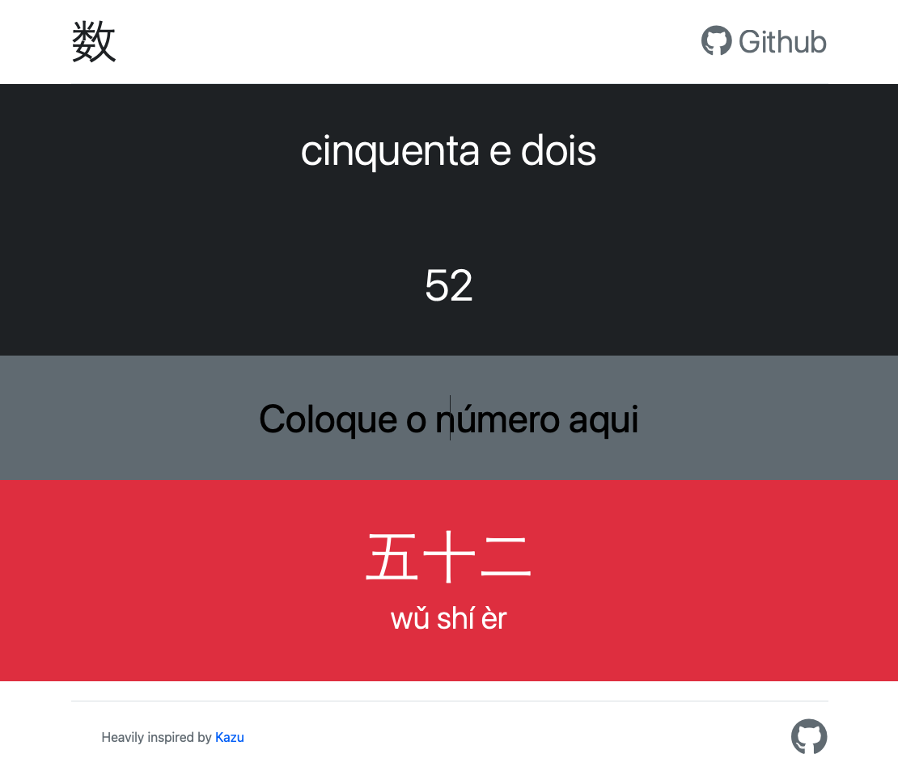

## Shu

# 🇧🇷 PT-BR
Shu é uma ferramenta pensada para ajudar estudantes de chinês a ler números, fortemente inspirado por [Kazu](http://sebpearce.com/kazu/).

~~Porque não começar já [testando](https://shu-number-to-chinese.herokuapp.com/)? https://shu-number-to-chinese.herokuapp.com/~~ (Heroku já não é mais grátis)

# 🇺🇸 EN
This tool was developed to help chinese language students to read chinese numbers, heavily inspired by [Kazu](http://sebpearce.com/kazu/).

~~Why don't you just [test](https://shu-number-to-chinese.herokuapp.com/) it? https://shu-number-to-chinese.herokuapp.com/~~ (Heroku is no longer free)
